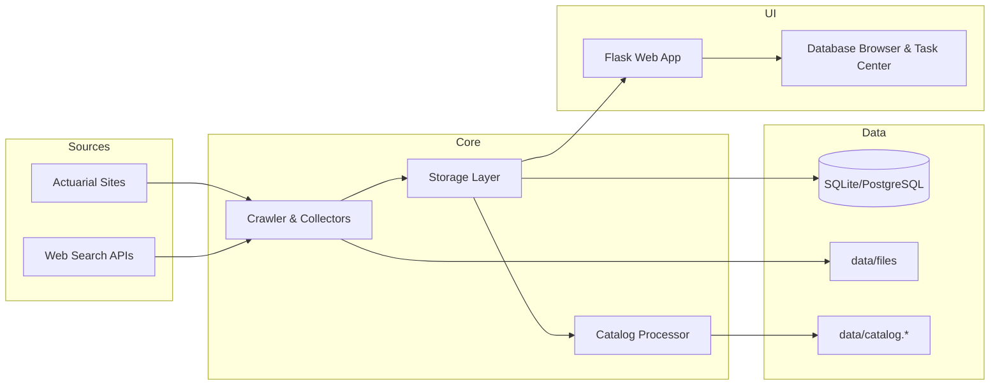

# AI Actuarial Info Search

AI Actuarial Info Search is a system for discovering, downloading, and cataloging AI-related documents from actuarial organizations worldwide, with a modern web interface for managing collections and data.

## Purpose

Help actuarial teams stay current on AI/ML developments through reliable discovery, structured cataloging, and a production-ready management UI.

## Key Features

- Web crawling and discovery across actuarial organization sites
- Optional web search expansion via Brave and SerpAPI
- Keyword-based filtering with multi-language support
- Downloads for PDF, Word, PowerPoint, Excel, and HTML sources
- SHA256-based deduplication to prevent duplicates
- Incremental cataloging with summaries, keywords, and categories
- **Markdown content management** - view, edit, and convert documents to markdown
- SQLite for local use and PostgreSQL for production
- Web interface for search, export, and operational management
- Per-task application logs and global operational logs

## Web Interface Capabilities

- Database browser with sorting, selection, and CSV export
- Site management with keyword and prefix exclusions
- Task center for running and monitoring collections
- **Markdown conversion** - convert locally-available PDFs and documents to markdown format (batch + per-file)
- **File detail pages** - view, edit, preview markdown, and submit conversion tasks
- Global logs and per-task logs for operational visibility
- Local file import with directory browsing
- Admin-only catalog CSV export endpoint: `GET /api/export?format=csv`

## Authentication Modes

- `REQUIRE_AUTH=true`: all pages and APIs require login (token or session).
- `REQUIRE_AUTH=false` (default): **guest read-only** mode.
  - Guests can browse Dashboard and Database (read-only).
  - Guests cannot download stored files or run/edit tasks.
  - Tasks / Schedule / Settings and all write operations require a token.

## Markdown Feature

The system supports viewing, editing, and converting documents to markdown format:

### File Detail Page
- **View Mode**: Renders markdown content with proper formatting (headings, lists, code blocks, tables)
- **Edit Mode**: Edit markdown directly in a textarea with monospace font
- **Manual save**: Markdown edits are saved when you click **Save Markdown**, with timestamp tracking
- **Source Tracking**: Tracks whether content is manual, converted, or original
- **Long document UX**: Markdown view is height-capped with an Expand/Collapse toggle
- **Conversion metadata**: Displays `markdown_source` and `markdown_updated_at` above the markdown section (when available)

### Markdown Conversion Task
- Batch conversion runs against **local files already downloaded/imported** (uses DB `local_path`, no re-download)
- Choose conversion engine: `marker`, `docling`, `mistral`, `deepseekocr`
- Batch window controls: start index (newest first) + scan count
- Skip already converted files, or overwrite existing markdown
- Progress tracking, per-task application log, and error reporting
- Conversion implementation is provided by the local `doc_to_md/` package (adapted from `ferryhe/doc_to_md`)

### Database Storage
- Markdown content stored in `catalog_items` table
- Fields: `markdown_content` (TEXT), `markdown_updated_at` (TEXT, SQLite `CURRENT_TIMESTAMP`), `markdown_source` (TEXT)
- Accessible via Storage API: `get_file_markdown()`, `update_file_markdown()`

## Conversion Engines

The markdown conversion feature supports multiple engines. Some are heavy and/or require API keys.

- `marker` (local PDF): requires `marker-pdf`
- `docling` (local multi-format): requires `docling`
- `mistral` (API): requires `MISTRAL_API_KEY`
- `deepseekocr` (API via SiliconFlow): requires `SILICONFLOW_API_KEY` and optionally `SILICONFLOW_BASE_URL`
Note: an `auto` mode previously existed but is intentionally disabled in the UI because it can be slow.

## Project Structure (High-Level)

- `ai_actuarial/` core package (crawler, catalog, storage, collectors, processors)
- `ai_actuarial/web/` web application (Flask app, templates, assets)
- `config/` site/category YAML plus optional python settings package (`config/settings.py` for conversion engines)
- `data/` downloaded files, catalogs, and database
- `docs/` implementation notes and operational guidance

## Project Directory Overview

```
AI_actuarial_inforsearch/
├─ ai_actuarial/           # Core package (crawler, catalog, storage, web app)
├─ config/                 # Site and category configuration
├─ data/                   # Downloads, catalog outputs, and database
├─ docs/                   # Implementation notes and summaries
├─ scripts/                # Maintenance and helper scripts
├─ SERVICE_START_GUIDE.md  # Service start guide (Linux + Windows)
├─ QUICK_START_NEW_FEATURES.md
├─ QUICK_REFERENCE.md
├─ DATABASE_BACKEND_GUIDE.md
├─ MODULAR_SYSTEM_GUIDE.md
├─ README.md
└─ requirements.txt
```

## Operations Manual

- Service start guide (Linux + Windows): `SERVICE_START_GUIDE.md`

## System Architecture



## Runtime Environment

| Component | Supported / Notes |
| --- | --- |
| Python | 3.10+ |
| Web Server | Flask (built-in dev server for local) |
| Database | SQLite (local), PostgreSQL (production) |
| Deployment | Docker + Docker Compose |
| Reverse Proxy | Caddy |
| OS | Windows (local), Linux (server) |

## Configuration Notes

- Web search keys: `BRAVE_API_KEY`, `SERPAPI_API_KEY`
- Markdown conversion API keys: `MISTRAL_API_KEY`, `SILICONFLOW_API_KEY`, `SILICONFLOW_BASE_URL`
- File deletion: set `ENABLE_FILE_DELETION=true` before starting the web service

## Documentation Index

- Quick start: `QUICK_START_NEW_FEATURES.md`
- Reference: `QUICK_REFERENCE.md`
- Database backend guide: `DATABASE_BACKEND_GUIDE.md`
- Modular system guide: `MODULAR_SYSTEM_GUIDE.md`
- Implementation and summaries: `docs/`

## Output Artifacts

- Downloaded files under `data/files/`
- Index database at `data/index.db` (SQLite) or PostgreSQL backend
- Incremental catalog outputs: `data/catalog.jsonl` and `data/catalog.md`
- Update logs under `data/updates/`
- Global application log: `data/app.log`
- Per-task logs: `data/task_logs/*.log`

---

AI Actuarial Info Search is built to keep actuarial teams current on AI/ML developments with reliable discovery, structured cataloging, and a production-ready management UI.
