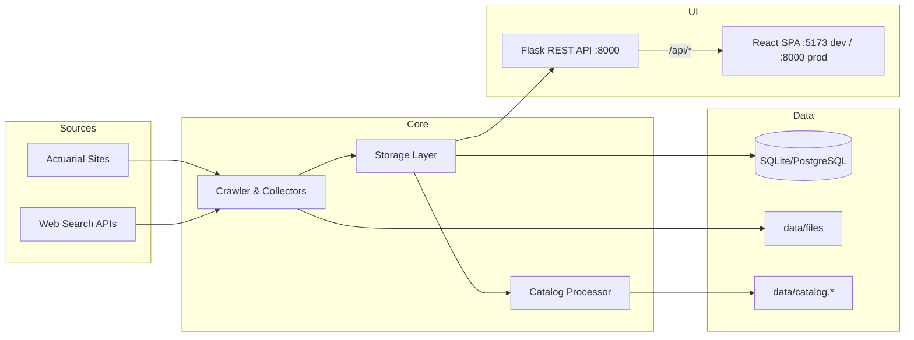

# AI Actuarial Info Search

AI Actuarial Info Search is a system for discovering, downloading, and cataloging AI-related documents from actuarial organizations worldwide, with a modern web interface, AI chatbot, and RAG-powered Q&A capabilities.

## Recent Updates (February 2026)

- ✅ **AI Chatbot Implemented** - Full RAG-based chatbot with multi-provider support
- ✅ **Configuration Migration** - Migrated from `.env` to YAML config with backward compatibility
- ✅ **Multi-AI Provider Support** - OpenAI, DeepSeek, Mistral, and custom providers
- ✅ **File Detail Page Improvements** - Enhanced chunk management with dynamic Add/Modify buttons
- ✅ **Documentation Reorganization** - Consolidated and timestamped all project documentation

## 项目架构说明（前后台组成）

本项目目前有 **两套 Web 界面**，均由同一个 Flask 后台提供 API 支持：

| 界面 | 技术栈 | 访问方式 | 特点 |
|------|--------|----------|------|
| **Flask 模板界面（旧）** | Python + Jinja2 HTML | `http://localhost:8000` | 服务端渲染，首屏快，功能完整 |
| **React SPA 界面（新）** | React 19 + TypeScript + Vite | `http://localhost:5173`（开发） | 客户端渲染，交互流畅，支持暗色主题 |

- **Flask 界面**：服务端渲染，页面由 Python 直接生成，首屏加载快，无需额外启动前端服务。
- **React 界面**：现代 SPA，JS bundle 初次加载后切换页面极快，用户体验更好，是长期维护的主界面。

两套界面都 **需要保留**，React 界面调用 Flask 的 `/api/*` REST 接口来获取和操作数据。

---

## 快速启动（Getting Started）

### 前提条件

- Python 3.10+
- Node.js 18+（含 npm，仅 React 界面需要）
- （可选）AI 服务的 API Key，配置在 `config/sites.yaml` 或 `.env`

### 只启动 Flask 界面（最简单，端口 8000）

```bash
# 安装 Python 依赖
pip install -r requirements.txt

# 启动服务（含 Flask HTML 界面 + REST API）
python -m ai_actuarial web --host 127.0.0.1 --port 8000
```

浏览器访问 `http://localhost:8000`，直接使用 Flask 服务端渲染界面。

---

### 同时启动 React 界面（两个终端）

**终端 1：Flask 后台（端口 8000）**

```bash
pip install -r requirements.txt
python -m ai_actuarial web --host 127.0.0.1 --port 8000
```

**终端 2：React 前台开发服务器（端口 5173）**

```bash
# 安装 Node 依赖（首次运行）
npm install

# 启动 Vite 开发服务器
npm run dev
```

Vite 会将 `/api/*` 请求自动代理到 `http://127.0.0.1:8000`，浏览器打开 `http://localhost:5173` 使用 React 界面。

---

> 完整的部署指南（Linux Docker + Caddy、Windows 本地）请参见：[docs/guides/SERVICE_START_GUIDE.md](docs/guides/SERVICE_START_GUIDE.md)

---

## Purpose

Help actuarial teams stay current on AI/ML developments through reliable discovery, structured cataloging, and a production-ready management UI.

## Key Features

- Web crawling and discovery across actuarial organization sites
- Optional web search expansion via Brave and SerpAPI
- Keyword-based filtering with multi-language support
- Downloads for PDF, Word, PowerPoint, Excel, and HTML sources
- SHA256-based deduplication to prevent duplicates
- Incremental cataloging with summaries, keywords, and categories
- **Markdown content management** - view, edit, and convert documents to markdown
- **AI Chatbot with RAG** - intelligent Q&A with document retrieval and citations
- **Multi-AI Provider Support** - configurable providers (OpenAI, DeepSeek, Mistral, etc.)
- SQLite for local use and PostgreSQL for production
- Web interface for search, export, and operational management
- Per-task application logs and global operational logs

## Web Interface Capabilities

- **Dashboard** - overview of collections, tasks, and system status
- **Database Browser** - search, filter, sort, and export catalog items
- **Site Management** - configure sites, keywords, and prefix exclusions
- **Task Center** - run and monitor crawling, cataloging, and conversion tasks
- **RAG Management** - manage chunk profiles, knowledge bases, and indexing
- **AI Chat** - interactive chat interface with knowledge base selection
- **Markdown Conversion** - batch or per-file document to markdown conversion
- **File Detail Pages** - view, edit, preview markdown, and submit tasks
- **Settings** - AI provider configuration, model selection, and system settings
- Global logs and per-task logs for operational visibility
- Local file import with directory browsing
- Admin-only catalog CSV export endpoint: `GET /api/export?format=csv`

## Authentication Modes

- `REQUIRE_AUTH=true`: all pages and APIs require login (token or session).
- `REQUIRE_AUTH=false` (default): **guest read-only** mode.
  - Guests can browse Dashboard and Database (read-only).
  - Guests cannot download stored files or run/edit tasks.
  - Tasks / Schedule / Settings and all write operations require a token.

## AI Chatbot with RAG ✅

A comprehensive AI-powered chatbot with RAG (Retrieval-Augmented Generation) capabilities has been implemented:

### Features
- **Knowledge Base Management**: Create and manage multiple RAG-based knowledge bases from markdown documents
- **Chunk Management**: Generate and manage document chunks with customizable profiles
- **Intelligent Q&A**: Ask questions and get accurate answers with citations from source documents
- **Multiple AI Providers**: Support for OpenAI, DeepSeek, Mistral, and other providers
- **Conversation History**: Persistent multi-turn conversations with context awareness
- **Web Interface**: Chat UI with knowledge base selection, conversation management, and settings

### Components
- **RAG Database**: Vector storage with chunk indexing and similarity search
- **Chunk Profiles**: Configurable chunking strategies (size, overlap, method)
- **Knowledge Bases**: Group and organize chunks for domain-specific Q&A
- **Chat Engine**: Multi-turn conversation with RAG retrieval and response generation
- **API & UI**: RESTful endpoints and modern chat interface

### Documentation
- Implementation complete: See `docs/20260212_PHASE2_COMPLETION_SUMMARY.md`
- Integration summary: See `docs/20260213_PHASE2_CHATBOT_INTEGRATION_SUMMARY.md`
- API documentation: See `docs/API文档-2026-02-12-聊天机器人API接口说明.md`
- User guide: See `docs/用户指南-2026-02-12-AI聊天机器人使用说明.md`

## Markdown Feature

The system supports viewing, editing, and converting documents to markdown format:

### File Detail Page
- **View Mode**: Renders markdown content with proper formatting (headings, lists, code blocks, tables)
- **Edit Mode**: Edit markdown directly in a textarea with monospace font
- **Manual save**: Markdown edits are saved when you click **Save Markdown**, with timestamp tracking
- **Source Tracking**: Tracks whether content is manual, converted, or original
- **Long document UX**: Markdown view is height-capped with an Expand/Collapse toggle
- **Conversion metadata**: Displays `markdown_source` and `markdown_updated_at` above the markdown section (when available)

### Markdown Conversion Task
- Batch conversion runs against **local files already downloaded/imported** (uses DB `local_path`, no re-download)
- Choose conversion engine: `marker`, `docling`, `mistral`, `deepseekocr`
- Batch window controls: start index (newest first) + scan count
- Skip already converted files, or overwrite existing markdown
- Progress tracking, per-task application log, and error reporting
- Conversion implementation is provided by the local `doc_to_md/` package (adapted from `ferryhe/doc_to_md`)

### Database Storage
- Markdown content stored in `catalog_items` table
- Fields: `markdown_content` (TEXT), `markdown_updated_at` (TEXT, SQLite `CURRENT_TIMESTAMP`), `markdown_source` (TEXT)
- Accessible via Storage API: `get_file_markdown()`, `update_file_markdown()`

## Conversion Engines

The markdown conversion feature supports multiple engines. Some are heavy and/or require API keys.

- `marker` (local PDF): requires `marker-pdf`
- `docling` (local multi-format): requires `docling`
- `mistral` (API): requires `MISTRAL_API_KEY`
- `deepseekocr` (API via SiliconFlow): requires `SILICONFLOW_API_KEY` and optionally `SILICONFLOW_BASE_URL`
Note: an `auto` mode previously existed but is intentionally disabled in the UI because it can be slow.

## Project Structure (High-Level)

- `ai_actuarial/` core package (crawler, catalog, storage, collectors, processors)
- `ai_actuarial/web/` web application (Flask app, templates, assets)
- `config/` site/category YAML plus optional python settings package (`config/settings.py` for conversion engines)
- `data/` downloaded files, catalogs, and database
- `docs/` implementation notes and operational guidance

## Project Directory Overview

```
AI_actuarial_inforsearch/
├─ ai_actuarial/           # Core package (crawler, catalog, storage, web app)
│   └─ web/                # Flask REST API backend (app.py, chat_routes.py, rag_routes.py)
├─ client/                 # React + TypeScript frontend (Vite, Tailwind, Wouter)
│   └─ src/pages/          # Dashboard, Database, Chat, Tasks, Knowledge, Settings, …
├─ config/                 # Site and category configuration
├─ data/                   # Downloads, catalog outputs, and database
├─ docs/                   # Implementation notes and summaries
├─ scripts/                # Maintenance and helper scripts
├─ dist/public/            # Built React assets (generated by npm run build)
├─ vite.config.ts          # Vite build & dev-proxy configuration
├─ package.json            # Node.js dependencies and npm scripts
├─ requirements.txt        # Python dependencies
├─ SERVICE_START_GUIDE.md  # Service start guide (Linux + Windows)
├─ QUICK_START_NEW_FEATURES.md
├─ QUICK_REFERENCE.md
├─ DATABASE_BACKEND_GUIDE.md
├─ MODULAR_SYSTEM_GUIDE.md
└─ README.md
```

## Operations Manual

- Service start guide (Linux + Windows): `SERVICE_START_GUIDE.md`

## System Architecture



## Runtime Environment

| Component | Supported / Notes |
| --- | --- |
| Python | 3.10+ |
| Web Server | Flask (built-in dev server for local) |
| Database | SQLite (local), PostgreSQL (production) |
| Deployment | Docker + Docker Compose |
| Reverse Proxy | Caddy |
| OS | Windows (local), Linux (server) |

## Configuration Notes

### Environment Variables
- Web search keys: `BRAVE_API_KEY`, `SERPAPI_API_KEY`
- Markdown conversion API keys: `MISTRAL_API_KEY`, `SILICONFLOW_API_KEY`, `SILICONFLOW_BASE_URL`
- File deletion: set `ENABLE_FILE_DELETION=true` before starting the web service
- Authentication: `REQUIRE_AUTH=true` (default: false for guest read-only mode)

### Configuration Migration (2026-02-15)
The project has migrated from `.env` file configuration to YAML-based configuration with backward compatibility:

- **New**: AI provider settings in `config/sites.yaml` under `ai_providers` section
- **Backward Compatible**: `.env` file still supported for API keys and basic settings
- **Flexible**: Mix and match - use `.env` for secrets and `sites.yaml` for structured config
- **Migration Guide**: See `docs/20260215_CONFIG_MIGRATION_PLAN.md`

### AI Provider Configuration
Configure AI providers in `config/sites.yaml`:
```yaml
ai_providers:
  openai:
    enabled: true
    api_key: "${OPENAI_API_KEY}"  # From environment variable
    default_model: "gpt-4o-mini"
    models:
      - "gpt-4o"
      - "gpt-4o-mini"
  deepseek:
    enabled: true
    api_key: "${DEEPSEEK_API_KEY}"
    default_model: "deepseek-chat"
```

See `.env.example` for all available environment variables.

## Documentation Index

Documentation is organized by category in the `docs/` folder. See [docs/README.md](docs/README.md) for the complete structure.

### Quick Start & Guides
- Quick start: [docs/guides/QUICK_START_NEW_FEATURES.md](docs/guides/QUICK_START_NEW_FEATURES.md)
- Quick reference: [docs/guides/QUICK_REFERENCE.md](docs/guides/QUICK_REFERENCE.md)
- Service start guide: [docs/guides/SERVICE_START_GUIDE.md](docs/guides/SERVICE_START_GUIDE.md)
- Database backend: [docs/guides/DATABASE_BACKEND_GUIDE.md](docs/guides/DATABASE_BACKEND_GUIDE.md)
- Modular system: [docs/guides/MODULAR_SYSTEM_GUIDE.md](docs/guides/MODULAR_SYSTEM_GUIDE.md)

### AI Chatbot Documentation
- Roadmap: [docs/guides/AI_CHATBOT_PROJECT_ROADMAP.md](docs/guides/AI_CHATBOT_PROJECT_ROADMAP.md)
- Quick start: [docs/guides/AI_CHATBOT_QUICK_START.md](docs/guides/AI_CHATBOT_QUICK_START.md)
- Implementation plan: [docs/plans/20260211_AI_CHATBOT_RAG_IMPLEMENTATION_PLAN.md](docs/plans/20260211_AI_CHATBOT_RAG_IMPLEMENTATION_PLAN.md)
- Architecture: [docs/architecture/20260212_PHASE2_1_CHATBOT_ARCHITECTURE_DESIGN.md](docs/architecture/20260212_PHASE2_1_CHATBOT_ARCHITECTURE_DESIGN.md)
- Completion summary: [docs/implementation/20260212_PHASE2_COMPLETION_SUMMARY.md](docs/implementation/20260212_PHASE2_COMPLETION_SUMMARY.md)
- Integration summary: [docs/implementation/20260213_PHASE2_CHATBOT_INTEGRATION_SUMMARY.md](docs/implementation/20260213_PHASE2_CHATBOT_INTEGRATION_SUMMARY.md)
- API documentation (中文): [docs/zh-cn/20260212_API_CHATBOT_API_REFERENCE.md](docs/zh-cn/20260212_API_CHATBOT_API_REFERENCE.md)
- User guide (中文): [docs/zh-cn/20260212_USER_GUIDE_CHATBOT.md](docs/zh-cn/20260212_USER_GUIDE_CHATBOT.md)

### Configuration & Migration
- Config migration plan: [docs/plans/20260215_CONFIG_MIGRATION_PLAN.md](docs/plans/20260215_CONFIG_MIGRATION_PLAN.md)
- Implementation report: [docs/implementation/20260215_CONFIG_MIGRATION_IMPLEMENTATION_REPORT.md](docs/implementation/20260215_CONFIG_MIGRATION_IMPLEMENTATION_REPORT.md)
- Multi-AI provider design: [docs/plans/20260214_MULTI_AI_PROVIDER_DESIGN.md](docs/plans/20260214_MULTI_AI_PROVIDER_DESIGN.md)
- AI configuration summary (中文): [docs/zh-cn/20260215_AI_CONFIGURATION_SUMMARY_CN.md](docs/zh-cn/20260215_AI_CONFIGURATION_SUMMARY_CN.md)

### Testing & Security
- Manual testing guide: [docs/testing/20260215_MANUAL_TESTING_GUIDE.md](docs/testing/20260215_MANUAL_TESTING_GUIDE.md)
- Manual testing checklist: [docs/testing/MANUAL_TESTING_CHECKLIST.md](docs/testing/MANUAL_TESTING_CHECKLIST.md)
- Phase 2 security: [docs/security/20260213_PHASE2_SECURITY_SUMMARY.md](docs/security/20260213_PHASE2_SECURITY_SUMMARY.md)
- Security guide: [docs/guides/SECURITY_IMPROVEMENTS_GUIDE.md](docs/guides/SECURITY_IMPROVEMENTS_GUIDE.md)

### Documentation Categories
- **Plans** (`docs/plans/`) - Planning and design documents
- **Implementation** (`docs/implementation/`) - Implementation reports and summaries
- **Architecture** (`docs/architecture/`) - System architecture and technical design
- **Security** (`docs/security/`) - Security analysis and hardening reports
- **Testing** (`docs/testing/`) - Testing guides and checklists
- **Guides** (`docs/guides/`) - User and developer operational guides
- **Chinese Docs** (`docs/zh-cn/`) - Chinese language documentation
- **Archive** (`docs/archive/`) - Historical and deprecated documentation

## Output Artifacts

- Downloaded files under `data/files/`
- Index database at `data/index.db` (SQLite) or PostgreSQL backend
- Incremental catalog outputs: `data/catalog.jsonl` and `data/catalog.md`
- Update logs under `data/updates/`
- Global application log: `data/app.log`
- Per-task logs: `data/task_logs/*.log`

---

AI Actuarial Info Search is built to keep actuarial teams current on AI/ML developments with reliable discovery, structured cataloging, and a production-ready management UI.
