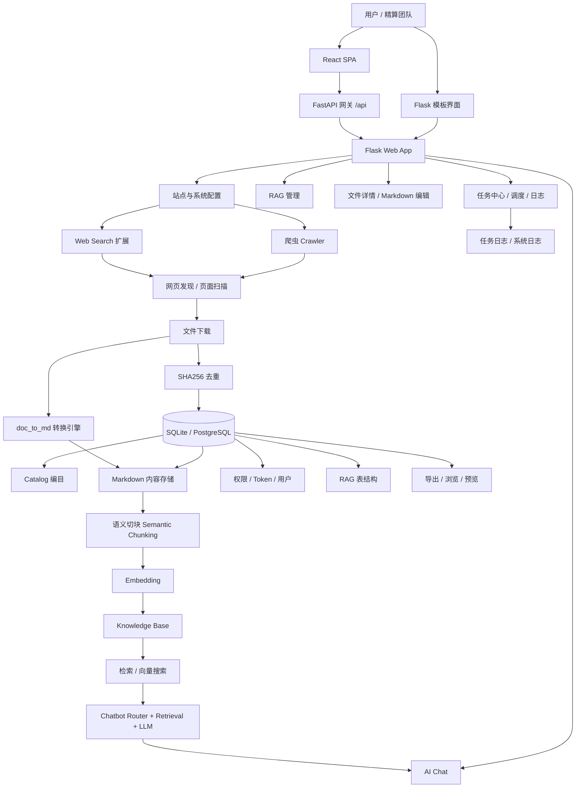
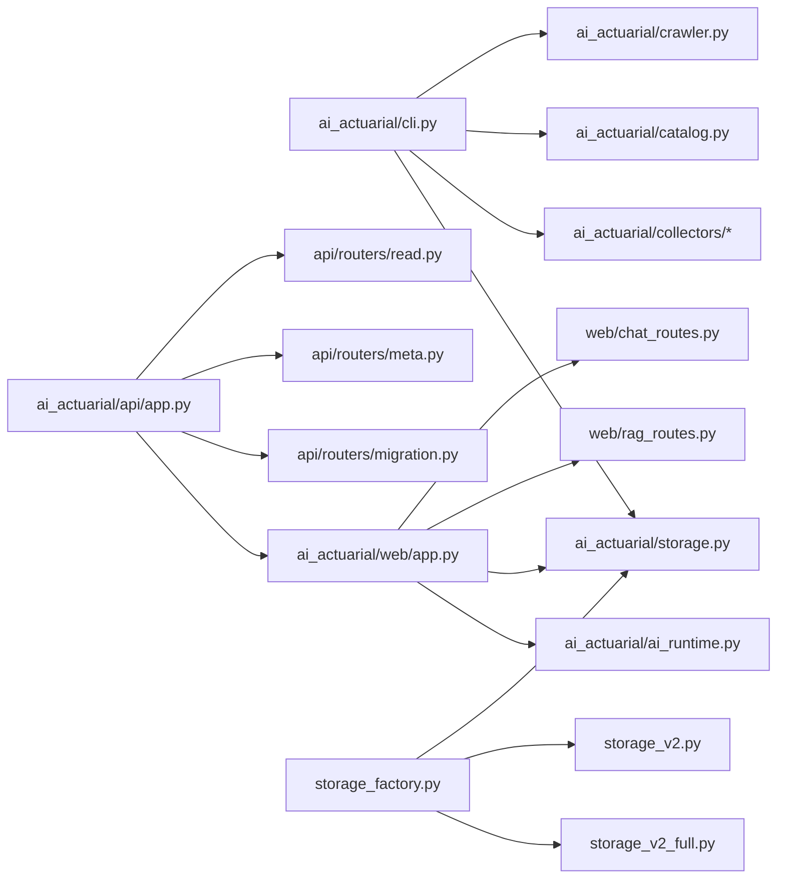
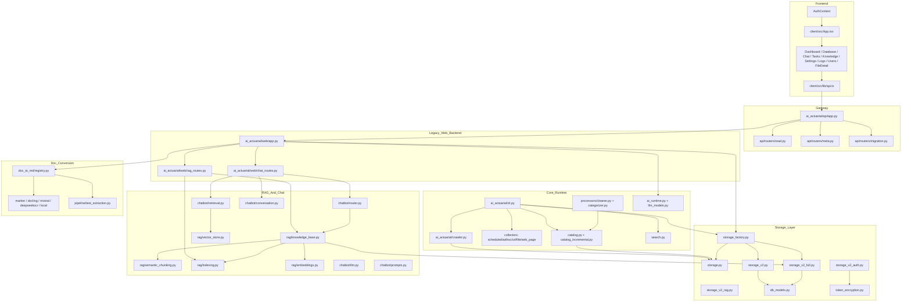
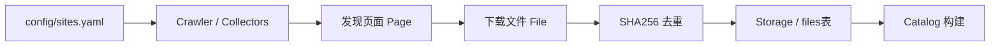
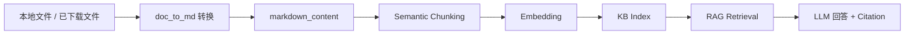
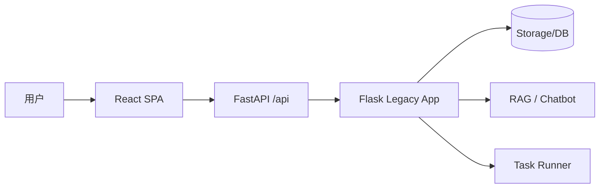
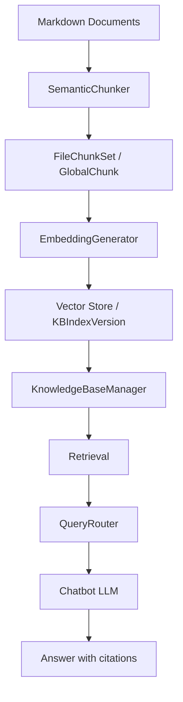

# AI_actuarial_inforsearch 项目知识图谱

项目地址：<https://github.com/ferryhe/AI_actuarial_inforsearch>

## 一句话定位

这是一个面向**精算/保险 AI 信息情报管理**的全栈系统：前端提供 React + Flask 双界面，后端负责抓取、下载、去重、编目、Markdown 转换、RAG 知识库构建、聊天问答、权限管理与任务运维。

---

## 1. 项目核心知识图谱（业务视角）



---

## 2. 模块知识图谱（代码结构视角）




> 注：上图里核心关系是对的，但为了阅读简洁，未把所有子模块全部展开。

---

## 3. 更完整的技术模块图谱



---

## 4. 关键实体与关系

### 4.1 业务实体

- **SiteConfig**：定义要抓取的网站、关键词、文件后缀、允许/排除规则
- **Page**：被访问或记录的网页
- **File**：从网页中发现并下载的文件
- **Blob / SHA256**：去重后的文件实体标识
- **CatalogItem**：对文件做摘要、关键词、分类后的编目结果
- **Markdown Content**：文件转换后的可读文本层
- **ChunkProfile**：切块策略配置
- **FileChunkSet / GlobalChunk**：RAG 切块结果
- **KnowledgeBase**：知识库实体
- **ChunkEmbedding / KBIndexVersion**：向量化和索引版本
- **Conversation / Chat Query**：聊天交互语义层
- **AuthToken / User / Permission Group**：权限控制实体
- **Task / Task Log**：操作执行与审计实体

### 4.2 关系主链

```text
SiteConfig
  -> Crawler
  -> Page
  -> File
  -> SHA256去重
  -> CatalogItem
  -> Markdown
  -> ChunkSet
  -> Embedding
  -> KnowledgeBase
  -> Retrieval
  -> Chatbot Answer
```

这条链就是这个项目最核心的“知识生成流水线”。

---

## 5. 数据流图谱

### 5.1 采集流



### 5.2 文档理解流



### 5.3 前后端交互流



---

## 6. 前端页面图谱

从 `client/src/pages` 看，React 前端已经形成一个比较完整的运营台：

- `Dashboard`：全局概览
- `Database`：数据库浏览与检索
- `FileDetail` / `FilePreview`：文件详情与 Markdown 预览编辑
- `Chat`：聊天问答
- `Tasks`：任务执行中心
- `Knowledge` / `KBDetail`：知识库管理
- `Settings`：AI 提供商、模型和系统设置
- `Logs`：日志视图
- `Users` / `Profile` / `Login` / `Register`：认证与账户管理

可以理解为：

```text
Dashboard 是总控台
Database / FileDetail 是内容资产层
Knowledge / Chat 是知识与问答层
Tasks / Logs 是运维执行层
Settings / Users 是治理与权限层
```

---

## 7. 后端接口图谱

根据代码扫描，主要接口层分两套：

### 7.1 Flask 主接口层

- `ai_actuarial/web/app.py`：主 Web 应用，路由最多（约 81 个）
- `ai_actuarial/web/rag_routes.py`：RAG/知识库专用接口（约 29 个）
- `ai_actuarial/web/chat_routes.py`：聊天相关接口（约 7 个）

### 7.2 FastAPI 网关层

- `ai_actuarial/api/app.py`：FastAPI 网关入口
- `api/routers/read.py`：原生读接口
- `api/routers/meta.py`：元信息接口
- `api/routers/migration.py`：迁移期兼容接口

关键特点是：

**FastAPI 不是完全替代 Flask，而是一个迁移中网关。**
当前结构更像：

```text
React -> FastAPI -> 未迁移部分继续回落 Flask
```

这说明项目在架构上正处于**前后端现代化迁移阶段**，而不是一个从头完全统一的新架构。

---

## 8. 存储图谱

项目的存储层明显分为三层演进：

1. **v1 传统 Storage**：`storage.py`
2. **v2 抽象存储层**：`storage_v2.py`
3. **v2_full 完整特性版**：`storage_v2_full.py`

再加上：
- `storage_v2_auth.py`：认证能力扩展
- `storage_v2_rag.py`：RAG 能力扩展
- `storage_factory.py`：统一入口，按配置选择 SQLite/PostgreSQL 与不同存储版本

这说明项目并不只是“写了一个数据库访问类”，而是在逐步把存储演化为：

```text
基础文件目录存储
-> 编目存储
-> 权限存储
-> RAG 存储
-> 多后端存储抽象
```

这是比较明确的“从工具脚本向产品后端演化”的痕迹。

---

## 9. RAG 知识图谱

RAG 子系统是这个项目的第二条主线，结构相对完整：



这里有几个关键点：
- `KnowledgeBaseManager` 是 RAG 编排中枢
- `SemanticChunker` 负责文本结构化切块
- `EmbeddingGenerator` 负责向量生成
- `QueryRouter` 做 KB 选择与意图路由
- `retrieval.py` 做召回
- `conversation.py` 管理多轮会话

这意味着它不是“简单把向量库接一下”，而是已经具备较完整的 KB 生命周期管理。

---

## 10. 文档转换图谱

`doc_to_md/` 是一个很重要的独立能力层，承担“外部文件 -> Markdown”转换：

- `engines/marker.py`
- `engines/docling.py`
- `engines/mistral.py`
- `engines/deepseekocr.py`
- `engines/local.py`
- `pipeline/text_extraction.py`
- `registry.py`

所以它本质上是一个**多引擎文档理解适配层**。这层的作用是把 PDF / Office / OCR 文档统一变成下游 RAG 可消费的 Markdown。

也就是说，项目真正的知识生产链不是从网页结束，而是：

```text
网页/文件采集 -> 文档转 Markdown -> 切块 -> 向量化 -> 知识库 -> 问答
```

---

## 11. 权限与治理图谱

从 `web/app.py` 与相关测试可以看出，权限模型不只是简单登录：

- 游客只读模式
- 注册用户 / Premium / Reader / Admin 等分组权限
- Token 管理
- 用户管理
- API Token 基础设施
- 任务权限 / 导出权限 / 聊天权限 / 文件下载权限

这说明项目目标不是单机脚本工具，而是**可面向不同角色开放的知识系统平台**。

---

## 12. 项目成熟度图谱（从代码与结构推断）

### 已明显成熟的能力
- 抓取与下载
- 编目与去重
- Markdown 管理
- RAG/KB 基础设施
- 聊天问答
- 双前端界面
- 权限与任务管理
- 测试体系（`tests/` 很完整）

### 正在演进中的能力
- FastAPI 迁移
- 存储版本升级（v1 -> v2 -> v2_full）
- 前端现代化替换 Flask 模板
- 多 AI Provider 统一配置

### 项目本质定位
这个项目不是单一“聊天机器人”，也不是单一“爬虫工具”，而是：

**一个面向精算知识情报场景的文档采集 + 内容治理 + RAG 问答 + 运维管理一体化平台。**

---

## 13. 代码规模侧写

基于代码扫描（排除常见依赖/构建目录）的大致结果：

- 总文件数：**319**
- 总代码行：**48,318**
- Python：**24,521 行**
- TSX：**9,329 行**
- HTML/Jinja：**8,396 行**
- Markdown 文档：**122 个文件**

这说明它是一个**后端主导、前端已成规模、文档密集型**项目。

---

## 14. 我建议你怎么读这个项目

如果你想最快理解这个仓库，建议按下面顺序看：

1. `README.md`
2. `ai_actuarial/cli.py` —— 了解采集主链
3. `ai_actuarial/web/app.py` —— 了解 Flask 主应用和权限/任务中心
4. `ai_actuarial/api/app.py` —— 了解 FastAPI 迁移网关
5. `ai_actuarial/rag/knowledge_base.py` —— 了解 RAG 编排中枢
6. `ai_actuarial/chatbot/router.py` + `retrieval.py` —— 了解聊天检索路径
7. `doc_to_md/` —— 了解文件转 Markdown 的独立能力层
8. `client/src/App.tsx` + `client/src/pages/*` —— 了解 React 产品界面结构
9. `tests/` —— 看项目当前真正重视什么能力

---

## 15. 一句话总结这个知识图谱

**AI_actuarial_inforsearch 的核心不是“搜信息”，而是把精算行业外部信息源持续转化为结构化知识资产，并通过 RAG、聊天和运营台让这些知识可检索、可管理、可问答、可治理。**
